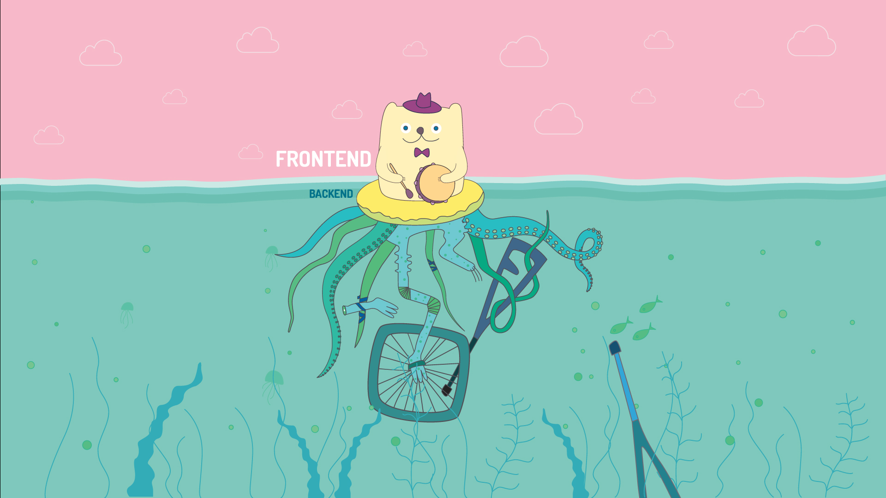
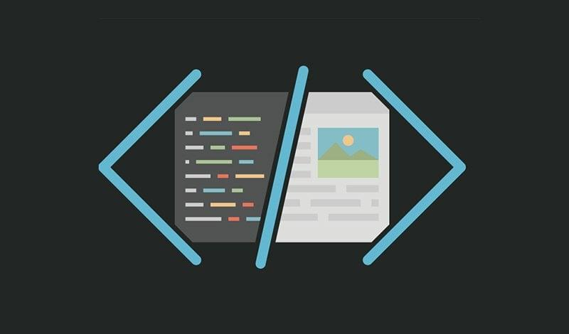

# Hello, World! 👋

Hi, I'm Ruslan, a frontend developer. Welcome to my GitHub profile, where I share my experience and projects.

## My Skills

- **HTML**: Understanding of web page structure and semantics.
- **CSS**: Experience in creating stylish and responsive user interfaces.
- **JavaScript**: Programming in pure JS, including interaction with the DOM and the use of modern APIs.

### Frameworks

I also actively work with modern frameworks, such as:

- **React**: Experience with React, including component creation, state management, and routing. Knowledge of Next.js and Vite for performance optimization and development.

## Frontend in My Blood

Frontend is not just my specialization, but my passion. I strive to create user interfaces that are not only functional but also bring joy to the user.

## Connect with Me

I'm happy to discuss projects, participate in interesting initiatives, or just chat. You can reach out to me via:

- [VKontakte](https://vk.com/fast_loverr)
- [Telegram](https://t.me/fast_loverr)

Feel free to drop me a message; I'm always open to new connections!

Thanks for visiting! 🚀
